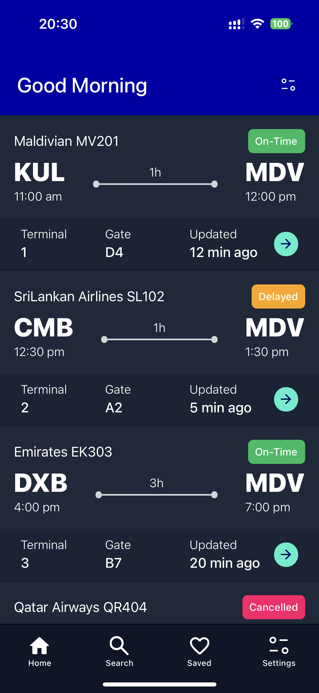
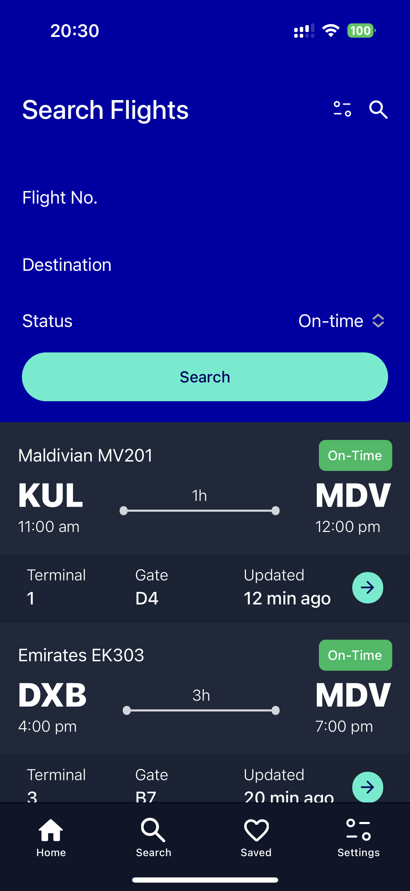
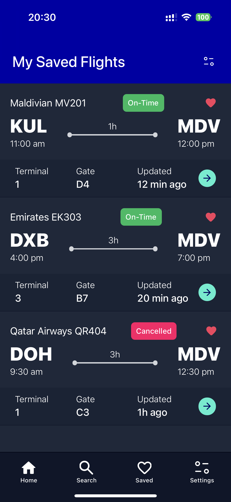
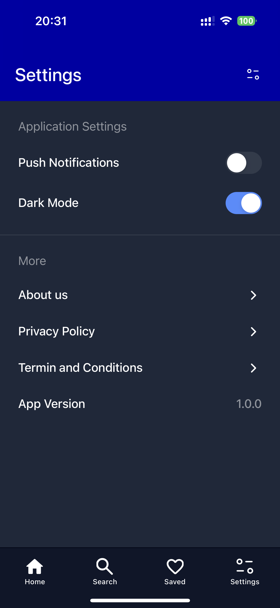
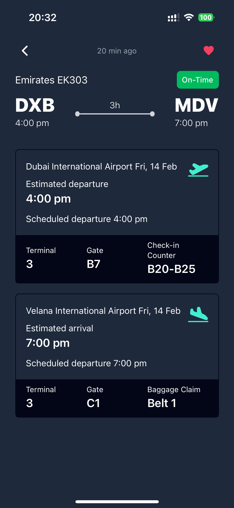

# MACL FlightTrack App

This repository contains the source code for the MACL FlightTrack mobile application, a flight tracking app designed for Maldives Airports Company Limited (MACL). The app allows users to track flights, search for specific flights, save flights of interest, and customize their app experience.

## Table of Contents

1. [Overview](#overview)
2. [Features](#features)
3. [Screens](#screens)
4. [Tech Stack](#tech-stack)
5. [Installation](#installation)
6. [Usage](#usage)
7. [Project Structure](#project-structure)
8. [Contributing](#contributing)
9. [Contact](#contact)

## 1. Overview

The MACL FlightTrack app provides a convenient way for passengers and airport staff to stay informed about flight statuses and details.  This repository contains the front-end implementation of the application.  It focuses on providing a user-friendly interface for accessing flight information, searching for flights, saving preferred flights, and customizing the app's appearance.

## 2. Features

*   **Flight Tracking:** Real-time (simulated) flight status updates.
*   **Flight Search:** Search for flights by flight number, destination, or flight status.
*   **Saved Flights:** Save flights for quick access and tracking.
*   **Settings:** Light/Dark mode theme switching.
*   **Flight Details Modal:** Comprehensive flight details including departure and arrival information.

## 3. Screens

The app consists of four main screens:

1.  **Landing Screen:** Displays a list of flights with key information:

    *   Airline Name
    *   Flight Number
    *   From Location Code & Time
    *   To Location Code & Time
    *   Terminal
    *   Gate
    *   Updated Time

2.  **Search Screen:** Allows users to search for flights using the following criteria:

    *   Flight Number
    *   Destination
    *   Flight Status

3.  **Saved Screen:**  Shows a list of flights that the user has saved for easy tracking.

4.  **Settings Screen:** Provides options to customize the app:

    *   Light/Dark Mode Toggle

**Flight Details Modal:**  A modal that appears when a user selects a flight from the list. It provides detailed information:

*   **Departure Details:**
    *   Departure Airport
    *   Estimated Departure Time
    *   Scheduled Departure Time
    *   Departure Terminal
    *   Departure Gate
    *   Check-in Counter

*   **Arrival Details:**
    *   Arrival Airport
    *   Estimated Arrival Time
    *   Scheduled Arrival Time
    *   Arrival Terminal
    *   Arrival Gate
    *   Baggage Claim

## 4. Tech Stack

*   **Frontend:** Angular, Ionic, Capacitor
*   **Styling:** Tailwind CSS, SASS

## 5. Installation

1.  Clone the repository: `git clone https://github.com/[your-username]/macl-flighttrack.git`
2.  Navigate to the project directory: `cd macl-flighttrack`
3.  Install dependencies: `npm install` or `yarn install` (depending on your package manager)

## 6. Usage

1.  Start the development server: `ng serve` or `ionic serve`
2.  The app should open in your browser or emulator.
